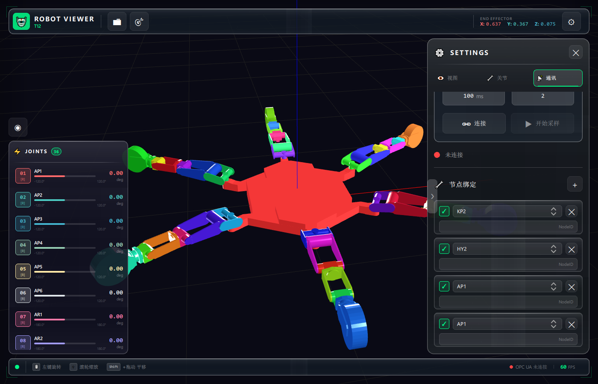

# RobotViewer

一个基于Qt 3D开发的机器人URDF模型查看器，支持通过OPC UA协议实时控制机器人关节运动。

## 功能特性

- 📁 **URDF模型加载**：支持加载标准URDF格式的机器人模型文件
- 🎮 **关节控制**：提供图形化界面实时调整机器人各关节角度
- 🔗 **OPC UA通信**：通过OPC UA协议连接外部控制系统，实现远程控制
- 🎨 **轨迹可视化**：支持显示和记录机器人末端执行器的运动轨迹
- 🖱️ **交互式3D视图**：支持鼠标拖拽旋转、缩放查看机器人模型
- 💾 **设置保存**：自动保存最近打开的模型和配置信息

## 软件界面



## 技术栈

- **Qt 5.15+**：跨平台应用程序框架
  - Qt 3D：3D图形渲染引擎
  - Qt Widgets：用户界面组件
  - Qt XML：URDF文件解析
- **Assimp**：3D模型加载库，支持多种3D文件格式
- **open62541**：OPC UA协议开源实现

## 系统要求

- Qt 5.15.2 或更高版本
- MSVC 2019 编译器（Windows）或 GCC/Clang（Linux）
- Assimp 库
- C++17 支持

## 构建说明

### Windows

1. 安装Qt 5.15.2（包含Qt 3D模块）
2. 安装Assimp库
3. 使用Qt Creator打开 `src/RobotViewer.pro`
4. 配置Assimp库路径（在.pro文件中）
5. 编译运行

### Linux

```bash
# 安装依赖
sudo apt-get install qt5-default qt3d5-dev libassimp-dev

# 构建项目
cd src
qmake RobotViewer.pro
make
```

## 使用说明

1. **加载模型**：通过菜单 `文件 -> 打开URDF` 选择机器人URDF模型文件
2. **关节控制**：在左侧关节控制面板中调整各关节角度
3. **OPC UA连接**：
   - 在OPC UA面板中输入服务器地址
   - 点击连接按钮建立通信
   - 选择对应的关节变量进行绑定
4. **轨迹显示**：勾选"显示轨迹"选项查看末端运动路径
5. **视图控制**：
   - 鼠标左键拖拽：旋转视角
   - 鼠标滚轮：缩放
   - 鼠标右键拖拽：平移视图

## 参考资源

- 示例模型来源：[urdf-loaders](https://github.com/gkjohnson/urdf-loaders)
- URDF格式说明：[ROS URDF Tutorials](http://wiki.ros.org/urdf/Tutorials)

## 开源库

- [open62541](https://github.com/open62541/open62541) - OPC UA协议实现
- [Assimp](https://github.com/assimp/assimp) - 3D模型导入库

## 许可证

详见 [LICENSE](LICENSE) 文件

## 贡献

欢迎提交Issue和Pull Request！

---

**注意**：本项目处于开发阶段，部分功能可能不稳定。
